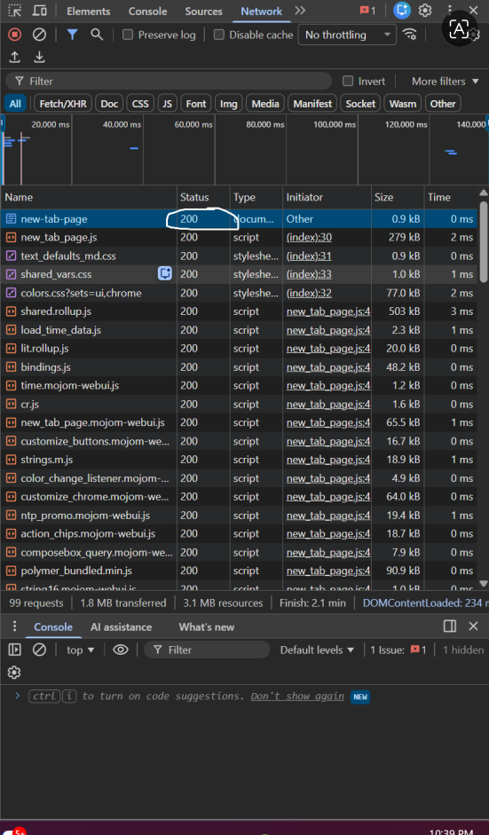
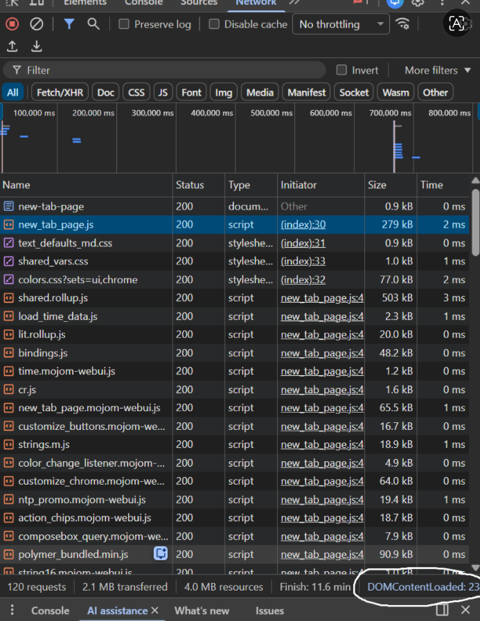
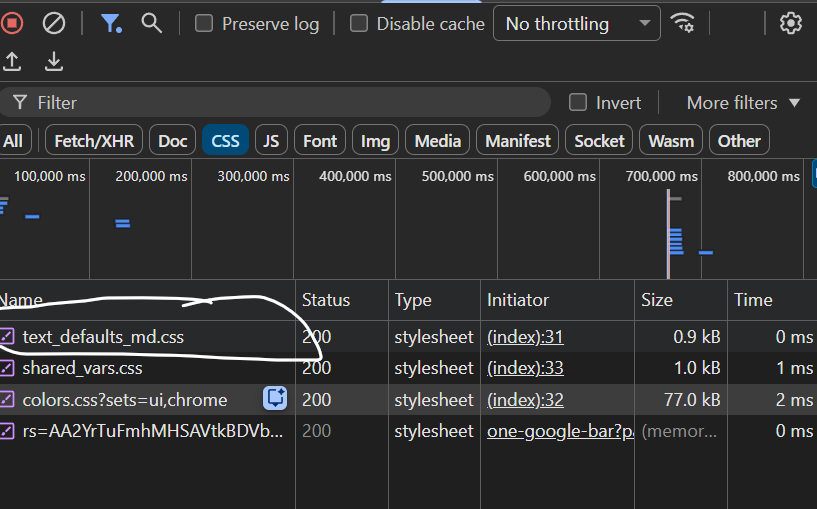

A1,
1:

5: bước đúng thứ tự (từ DNS lookup đến render) khi bạn truy cập https://shopee.vn:

1. Phân giải tên miền (DNS Lookup):
Trình duyệt không thể kết nối trực tiếp với cái tên "shopee.vn". Nó sẽ gửi yêu cầu đến DNS Server để tìm kiếm địa chỉ IP tương ứng với tên miền đó (giống như việc tra danh bạ điện thoại để tìm số của một người).

2. Thiết lập kết nối (TCP Handshake & TLS/SSL):
Sau khi có IP, trình duyệt thiết lập kết nối TCP với server của Shopee. Vì bạn dùng https, trình duyệt và server sẽ thực hiện thêm bước TLS handshake để trao đổi khóa mã hóa, đảm bảo dữ liệu truyền đi được bảo mật.

3. Gửi HTTP Request:
Khi kết nối đã an toàn, trình duyệt gửi một HTTP GET Request đến server để yêu cầu nội dung của trang web (thường là file index.html).

4. Server phản hồi (HTTP Response):
Server của Shopee nhận yêu cầu, xử lý và gửi trả lại một HTTP Response. Phản hồi này bao gồm mã trạng thái (ví dụ: 200 OK) và nội dung file HTML của trang web.

5. Xây dựng và Hiển thị (Rendering):
Trình duyệt nhận file HTML và bắt đầu quá trình Render:
Phân tích HTML để dựng cấu trúc trang (DOM Tree).
Tải thêm các tài nguyên khác như CSS, JavaScript, hình ảnh.
Kết hợp HTML và CSS để tính toán vị trí, màu sắc và hiển thị (vẽ) giao diện hoàn chỉnh lên màn hình cho bạn thấy.

2:

1. Tab Network trong DevTools cho thấy thông tin gì?
Tab Network hiển thị tất cả các tài nguyên mà trình duyệt đã tải về để hiển thị trang web. Các thông tin chính bao gồm:

Tên file (Name): Các file HTML, CSS, JS, hình ảnh, API...

Trạng thái (Status): Mã phản hồi từ server (ví dụ: 200 OK, 404 Not Found).

Loại file (Type): Định dạng tài liệu được tải lên.

Kích thước (Size): Dung lượng của tài nguyên.

Thời gian (Time): Tổng thời gian để tải xong tài nguyên đó.

Thứ tự tải (Waterfall): Biểu đồ thời gian trực quan của các request.

2. 

A2,
Trang web trên bị đánh giá SEO thấp vì sử dụng "Divitis" (lạm dụng thẻ 
).

Thiếu cấu trúc: Thẻ 
 là một thẻ vô nghĩa (non-semantic). Google Bot khi quét qua sẽ không biết đâu là phần đầu trang, đâu là menu điều hướng, hay đâu là nội dung chính.

Không xác định được nội dung quan trọng: Việc dùng 
 cho tiêu đề sản phẩm khiến Google không hiểu đó là từ khóa chính để ưu tiên lập chỉ mục (index).

Khả năng tiếp cận (Accessibility) kém: Các trình đọc màn hình cho người khiếm thị sẽ không thể hỗ trợ người dùng điều hướng trang web hiệu quả.

STT,Lỗi Semantic,Cách sửa,Lý do
1,"Dùng 
, main, footer","Thay bằng <header>, <main>, <footer>",Đây là các thẻ bố cục (Layout) giúp định vị cấu trúc trang.
2,Dùng 
 cho menu điều hướng,"Thay bằng thẻ <nav> kết hợp với danh sách <ul>, <li>",Giúp Google nhận diện đây là các liên kết quan trọng của trang.
3,"Tiêu đề sản phẩm dùng 
",Thay bằng thẻ tiêu đề <h2> hoặc <h3>,Thẻ heading giúp xác định cấp bậc nội dung và cực kỳ quan trọng cho SEO.
4,Thẻ  thiếu thuộc tính alt,"Thêm thuộc tính alt=""iPhone 16 Pro""",Thuộc tính alt giúp Google hiểu ảnh nói về gì và hiển thị khi ảnh lỗi.

A3,
1. Kết quả hiển thị (Text Art)
Dựa vào tính chất của các thẻ, kết quả trên trình duyệt sẽ trông như sau:

Plaintext
Hộp 1
Text A Text B
Hộp 2
Text C Text D
Hộp 3
2. Giải thích tại sao
Kết quả trên được tạo ra bởi sự khác biệt giữa hai loại hiển thị cơ bản trong HTML:

Thẻ Block (
): Luôn bắt đầu trên một dòng mới và chiếm trọn vẹn chiều rộng của hàng đó (100% width). Do đó, "Hộp 1", "Hộp 2" và "Hộp 3" đều đứng riêng một mình một dòng.

Thẻ Inline (, <strong>): Chỉ chiếm không gian vừa đủ với nội dung của nó và không bắt đầu trên dòng mới. Các thẻ này sẽ nằm cạnh nhau trên cùng một hàng nếu hàng đó còn chỗ trống.

"Text A" và "Text B" nằm cùng hàng vì đều là thẻ .

"Text C" và "Text D" nằm cùng hàng vì  và <strong> đều là inline.

A4,
1. Phân biệt <thead>, <tbody>, <tfoot>Đây là các thẻ dùng để phân nhóm nội dung trong một bảng (<table>), giúp cấu trúc bảng rõ ràng hơn:ThẻTên đầy đủChức năng<thead>Table HeadChứa các hàng tiêu đề của bảng (thường là tên các cột).<tbody>Table BodyChứa phần nội dung dữ liệu chính của bảng.<tfoot>Table FootChứa phần tổng kết hoặc ghi chú ở cuối bảng (ví dụ: Tổng tiền).
2. Tại sao KHÔNG NÊN dùng table để tạo layout? (3 lý do)Trong phát triển web hiện đại, việc dùng bảng để chia bố cục trang web (layout) bị coi là một sai lầm vì:Sai ý nghĩa ngữ nghĩa (Semantic): Thẻ <table> được sinh ra để hiển thị dữ liệu dạng bảng (như danh sách điểm, bảng giá). Sử dụng nó để làm bố cục khiến Google Bot và các trình đọc màn hình không hiểu được đâu là nội dung chính của trang web.Khó tùy biến Responsive: Bảng có cấu trúc rất cứng nhắc. Khi xem trên điện thoại di động (màn hình nhỏ), việc làm cho một cái bảng co giãn hoặc xếp chồng các cột lên nhau là cực kỳ khó khăn và phức tạp so với dùng Flexbox hay CSS Grid.Hiệu năng và bảo trì: Code HTML sử dụng table cho layout thường rất lồng nhão (nested tables), làm tăng dung lượng file và khiến trình duyệt mất nhiều thời gian hơn để render (vẽ) trang web. Ngoài ra, việc sửa đổi giao diện sau này sẽ trở thành một "cơn ác mộng" đối với lập trình viên.

B3.
Lỗi 1: Dòng 1 – Thẻ <!DOCTYPE> thiếu khai báo loại tài liệu – Cách sửa: Đổi thành <!DOCTYPE html>.
Lỗi 2: Dòng 5 – Giá trị thuộc tính charset viết sai định dạng – Cách sửa: Đổi thành UTF-8.
Lỗi 3: Dòng 8 – Thẻ <h1> kết thúc sai cú pháp (<h1> thay vì </h1>) – Cách sửa: Đổi thành </h1>.
Lỗi 4: Dòng 12, 13 – Thuộc tính href thiếu định dạng đường dẫn hợp lệ cho link nội bộ – Cách sửa: Thêm dấu # (ví dụ #home).
Lỗi 5: Dòng 20 – Thuộc tính src của thẻ  thiếu dấu ngoặc kép – Cách sửa: Viết lại thành src="iphone.jpg".
Lỗi 6: Dòng 20 – Thẻ  thiếu thuộc tính alt (lỗi semantic quan trọng cho SEO) – Cách sửa: Thêm alt="iPhone 16 Pro".
Lỗi 7: Dòng 22 – Thẻ 
 và <b> bị lồng sai thứ tự (Overlapping tags) – Cách sửa: Đóng thẻ theo đúng thứ tự mở <b>...</b>
.
Lỗi 8: Dòng 28, 29 – Tiêu đề của bảng sử dụng thẻ <td> – Cách sửa: Sử dụng thẻ <th> để đúng ngữ nghĩa cho hàng tiêu đề.
Lỗi 9: Dòng 26 – Bảng thiếu các thẻ cấu trúc phân đoạn – Cách sửa: Thêm <thead> cho phần tiêu đề và <tbody> cho phần nội dung.
Lỗi 10: Dòng 38 – Sử dụng hai thẻ <main> trên cùng một trang (Mỗi trang chỉ được phép có duy nhất một thẻ <main>) – Cách sửa: Đổi thẻ <main> thứ hai thành <aside>.

Câu C1 (10đ) — Thiết kế cấu trúc HTML
Dưới đây là cấu trúc HTML tuân thủ nguyên tắc Semantic HTML (HTML ngữ nghĩa) cho một trang chi tiết sản phẩm, kèm theo comment giải thích cho từng thẻ:

HTML
<header> <nav> <ul> <li><a href="#">Trang chủ</a></li> <li><a href="#">Sản phẩm</a></li>
        </ul>
    </nav>
</header>

<main> <nav aria-label="breadcrumb"> <ol> <li><a href="#">Trang chủ</a></li> <li><a href="#">Điện thoại</a></li>
            <li><a href="#">iPhone 16</a></li>
        </ol>
    </nav>

    <article> <section id="product-gallery"> <figure>  
                
                
                
            </figure>
        </section>

        <section id="product-info"> <h1>iPhone 16 Pro Max</h1> 
30.000.000đ
 
⭐⭐⭐⭐⭐
 
Mô tả chi tiết về sản phẩm...
 </section>

        <section id="tech-specs">
            <h2>Thông số kỹ thuật</h2> <table> <tbody> <tr> <th>Màn hình</th> <td>6.7 inch</td> </tr>
                    </tbody>
            </table>
        </section>

        <section id="reviews">
            <h2>Đánh giá từ khách hàng</h2>
            <article class="review-item"> <h3>Người dùng A</h3> 
Sản phẩm rất tốt!

            </article>
        </section>

    </article>

    <aside> <h2>Sản phẩm tương tự</h2>
        <ul> <li><a href="#">iPhone 15 Pro</a></li>
            <li><a href="#">iPhone 16 Plus</a></li>
        </ul>
    </aside>

</main>

<footer> 
© 2026 Bản quyền thuộc về Cửa hàng.

</footer>
Câu C2 (10đ) — So sánh & Tranh luận (Phản biện đồng nghiệp)
Chào bạn, việc lạm dụng thẻ 
 cho mọi thứ có thể giúp chúng ta dựng giao diện nhanh chóng trong ngắn hạn, nhưng về lâu dài, việc bỏ qua Semantic HTML (HTML ngữ nghĩa) sẽ làm mất đi những giá trị kỹ thuật cốt lõi của website. Dưới đây là những lý do chúng ta nên sử dụng thẻ semantic:

Thứ nhất, tối ưu hóa công cụ tìm kiếm (SEO). Các bot của Google không "nhìn" website giống con người mà chúng đọc cấu trúc code. Khi dùng các thẻ như <article>, <h1> hay <nav>, ta đang trực tiếp "chỉ điểm" cho bot biết đâu là nội dung chính, đâu là tiêu đề, đâu là menu điều hướng. Một trang web toàn 
 sẽ giống như một cuốn sách không có mục lục hay tiêu đề chương, khiến bot khó phân loại và lập chỉ mục, từ đó ảnh hưởng xấu đến thứ hạng tìm kiếm.

Thứ hai, đảm bảo Khả năng truy cập (Accessibility). Người khiếm thị sử dụng Trình đọc màn hình (Screen Readers) để duyệt web. Các phần mềm này dựa vào thẻ semantic để hiểu và thông báo cho người dùng.

Ví dụ cụ thể: Nếu bạn tạo một nút bấm bằng 
, trình đọc màn hình sẽ chỉ đọc nó là một khối văn bản bình thường. Người dùng khiếm thị sẽ không hề biết họ có thể tương tác (click) vào đó. Nhưng nếu dùng thẻ <button>, phần mềm sẽ thông báo rõ đây là một "Nút bấm", giúp họ dễ dàng thao tác và trải nghiệm trang web.

Trường hợp thực tế vẫn cần dùng 
:
Nói như vậy không có nghĩa là thẻ 
 là vô dụng. Chúng ta vẫn sử dụng 
 trong trường hợp cần tạo ra một "hộp chứa" (container) thuần túy để dàn trang (layout) bằng CSS mà không mang ý nghĩa nội dung. Ví dụ: Khi bạn cần bọc 3 khối sản phẩm lại để áp dụng thuộc tính display: flex hay display: grid, việc dùng 
 là hoàn toàn chính xác và hợp lý nhất.